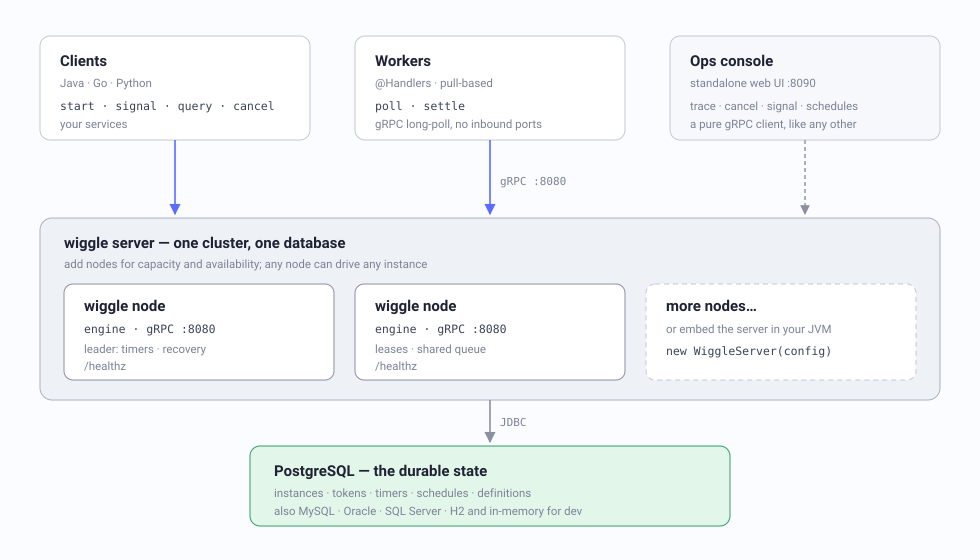
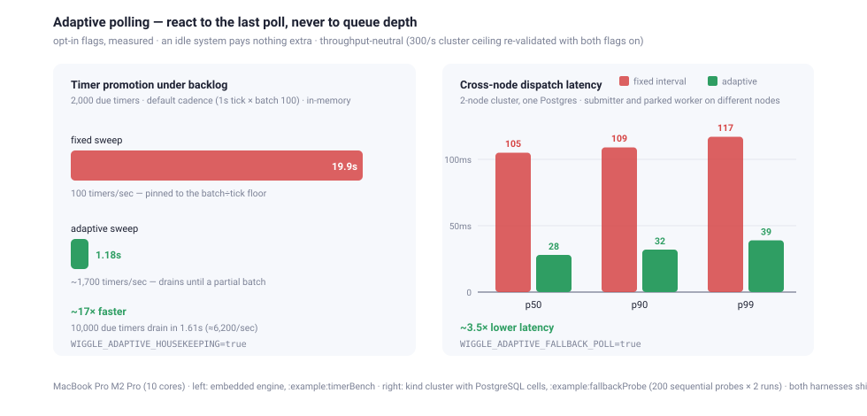

<div align="center">

<picture>
  <source media="(prefers-color-scheme: dark)" srcset="docs/img/wiggle-logo-dark.svg">
  
</picture>

### Durable workflows, in a JAR and a database.

**Describe a process as a graph. Wiggle runs it as a durable state machine that survives
crashes, waits for humans, and retries failures — with a server you can embed, and workers in
the language you already use.**

[](https://central.sonatype.com/artifact/sh.wiggle/wiggle-client)
[](https://hub.docker.com/r/hadielmougy/wiggle)
[](https://github.com/hadielmougy/wiggle/pkgs/container/wiggle)
[](LICENSE)

[](https://github.com/hadielmougy/wiggle-go)
[](https://github.com/hadielmougy/wiggle-python)

</div>

```java
interface OrderSteps {                                  // the steps, as a contract
    Order   validate(Order o);
    boolean inStock(Order o);
    Order   authorise(Order o);
    ...
}

FlowSpec orders = FlowSpec.define("order-fulfilment", Order.class, OrderSteps.class, (f, s) -> {
    var validated = f.thenApply(s::validate).thenFilter(s::inStock);

    var payment  = validated.thenApply(s::authorise).thenApply(s::capture);
    var shipping = validated.thenApply(s::reserveStock).thenApply(s::printLabel);

    return Wiggle.allOf(payment, shipping)          // both arms run, on isolated context copies
            .combineWithContext(s::merge)           // and rejoin explicitly
            .thenApply(s::notify);
});
```

That's a **complete, durable, parallel workflow**. No YAML, no DSL files, no determinism rules
to memorize — a compiled graph the server owns, and plain Java methods (or Go, or Python) that
serve its steps.

A spec **names** its steps; it never runs them — the code is bound by name on a worker. So the steps
are declared as an interface and named through it, which is why the compiler can check that each step
consumes what the one before it produced. A handler that `implements OrderSteps` is then checked
against the same contract, so the two halves cannot drift. Continuing `validated` twice is what makes
the two parallel arms.

---

**Contents** ·
[What is Wiggle?](#1-what-is-wiggle) ·
[Deployment options](#2-deployment--running-options) ·
[Java example](#3-example-in-java) ·
[Architecture](#4-architecture) ·
[Performance](#5-performance) ·
[Configuration](#6-configuration) ·
[Roadmap](#7-roadmap) ·
[Docs & links](#docs--links)

---

## 1. What is Wiggle?

Wiggle is a **durable workflow engine**: a JAR and a database. You define a
business process as pure **topology** (named steps and how they chain, branch, and rejoin);
Wiggle persists every instance as tokens moving over that graph, so a process **survives
restarts, retries, and worker death** and resumes exactly where it left off. Steps are executed
by **pull-based workers** over gRPC — your services, in your processes, in your language.

Its distinctive move is that the workflow **is data**: a compiled graph the server walks, not
replayed code. So there is no determinism discipline to get wrong, and a running process can be
inspected, traced and versioned like any other row in your database.

**Why teams pick it:**

- 💾 **Durable, honestly** — every instance is DB-backed. Exactly-once dispatch, at-least-once
  execution, lease-based recovery when a worker dies mid-step.
- 🧭 **State machine, not glue code** — `step`, `gate`, `choose`, `fork`, `sleep`, signals,
  timers, sub-flows, `repeatWhile`, `thenForEach` — a compiled graph, versioned by content hash.
  **No workflow-code determinism to get wrong**, because the workflow *is* data, not replayed code.
- 🔌 **Pull-based & polyglot** — workers long-poll over gRPC: no inbound connectivity, no broker,
  backpressure built in. Idiomatic **Java, Go, and Python** workers interoperate on one server —
  a single instance can have steps served by three languages, dispatched by activity name.
- 🪶 **Lightweight & embeddable** — the whole thing is a JAR plus a database
  (PostgreSQL, or in-memory for dev). Embed the server in your JVM for tests, or run it as one
  process beside your services. No Elasticsearch, no sidecar mesh, no mandatory Kubernetes.
- 🖥 **Operable from day one** — a web **ops console** (live trace of every instance over the
  workflow diagram, cancel, deliver signals, schedules, search by instance or correlation id),
  `/healthz` probes, queue-lag monitoring, memory admission control.

In one picture — a single `orders` instance whose steps run on **different microservices**,
routed by each step's **queue**. The server keeps the durable state; each service just pulls the
steps it serves:


<sub>How queue routing works end to end → **[docs/queues.md](docs/queues.md)**</sub>

---

## 2. Deployment & running options

One codebase, three postures — start embedded, grow into a cluster, **without rewriting your workflows**.

| Mode | What it is |
|---|---|
| **Embedded** | `WiggleServer` inside your JVM, in-memory or DB store |
| **Standalone server** | one node, gRPC `:8080`, in-memory or a database |
| **Cluster** | several nodes on **one database** — shared queue, leader runs timers/recovery |

### 2.1 Embedded — one JVM, zero infrastructure

The server is a library. No database configured means an in-memory store — perfect for tests:

```java
try (WiggleServer server = new WiggleServer(ServerConfig.fromEnvironment()).start();
     WiggleClient client = new WiggleClient(server.baseUrl())) {
    // register flow specs, run workers, start instances — all in-process
}
```

### 2.2 Standalone server & cluster

```bash
./gradlew :dist:run        # single node, in-memory, gRPC on :8080
```

Or **download the pre-built distribution** from the [GitHub release](https://github.com/hadielmougy/wiggle/releases)
and run it directly — no build, no Maven, no registry, just a JRE 21 (ideal for airgapped or
locked-down environments). Each release attaches `wiggle-server-<version>.tar`/`.zip` plus a signed
`SHA-256SUMS`:

```bash
tar xf wiggle-server-0.0.6.tar
sha256sum -c SHA-256SUMS           # optional: verify the download
WIGGLE_JDBC_URL=jdbc:postgresql://db:5432/wiggle \
  WIGGLE_JDBC_USER=wiggle WIGGLE_JDBC_PASSWORD=wiggle \
  ./wiggle-server-0.0.6/bin/wiggle
```

As a container — one image bundles **every** storage backend; the JDBC URL scheme picks one at
runtime, so you never build a per-database image. The signed, multi-arch (amd64 + arm64) image is
published to **both Docker Hub and GitHub Container Registry** — pull from whichever your
environment prefers:

```bash
docker run --rm -p 8080:8080 \
  -e WIGGLE_JDBC_URL=jdbc:postgresql://db:5432/wiggle \
  -e WIGGLE_JDBC_USER=wiggle -e WIGGLE_JDBC_PASSWORD=wiggle \
  hadielmougy/wiggle:0.0.6                 # Docker Hub
  # ghcr.io/hadielmougy/wiggle:0.0.6       # …or GHCR (same image)
```

**Clustering is just a shared database.** Point several nodes at one PostgreSQL and they form a
cluster: every node serves the API and hands out work; exactly one is elected leader for
clock-driven duties (timers, lease recovery, schedules). Kill any node — including the leader —
and the rest carry on. The schema creates and migrates itself on startup (versioned, forward-only
migrations under a cross-node advisory lock).

```bash
docker compose up -d postgres
scripts/cluster.sh 20            # three server nodes, two workers, one Postgres
scripts/kind-up.sh 3             # or the same on Kubernetes (kind)
```

On a real cluster, the [Helm chart](deploy/helm/wiggle) deploys a hardened, non-root pod (distroless
image, read-only root filesystem, all capabilities dropped — passes a *restricted* PodSecurity
namespace unmodified). Point `image.registry` at your internal registry and you're done:

```bash
helm install wiggle deploy/helm/wiggle \
  --set image.registry=artifactory.example.com \
  --set storage.jdbc.url=jdbc:postgresql://postgres:5432/wiggle \
  --set storage.jdbc.user=wiggle --set storage.jdbc.password=secret \
  --set replicaCount=3
```

### 2.3 The ops console

A standalone web UI that is a **pure gRPC client** — point it at a cluster with `WIGGLE_URL`.
Live instance trace over the workflow diagram, cancel, deliver signals, schedules, and search by
**instance id or correlation id**. Optional login with an operator account and a **read-only
viewer** account. Server nodes themselves serve no UI — just a `/healthz` probe for Kubernetes.

```bash
WIGGLE_URL=localhost:8080 ./gradlew :console:run    # → http://localhost:8090
```

---

## 3. Example in Java

The fastest end-to-end: an embedded server, one worker, one instance — one JVM.

```java
import com.wiggle.client.flow.*;
import com.wiggle.client.worker.*;
import com.wiggle.core.InstanceView;
import com.wiggle.server.*;

import java.time.Duration;
import java.util.HashMap;
import java.util.Map;

// 1. The logic lives in a @ForFlow class. The signature defines the step.
@ForFlow("greet")
class GreetHandlers implements GreetSteps {
    public Map<String, Object> sayHello(Map<String, Object> ctx) {
        Map<String, Object> next = new HashMap<>(ctx);
        next.put("greeting", "hello, " + ctx.get("name"));
        return next;
    }
}

// 2. The workflow names its steps through a contract. Nothing runs here -- the chain is walked
//    once and compiled to a graph; the code that runs each step is bound by name on the worker.
interface GreetSteps { Map<String, Object> sayHello(Map<String, Object> ctx); }

FlowSpec greet = FlowSpec.define("greet", Map.class, GreetSteps.class, (f, s) -> f.thenApply(s::sayHello));

// 3. Embedded server + worker + one instance.
try (WiggleServer server = new WiggleServer(ServerConfig.fromEnvironment()).start();
     WiggleClient client = new WiggleClient(server.baseUrl())) {

    try (Worker worker = new Worker(client, "worker-1")
            .registerHandler(new GreetHandlers())) {
        worker.start();

        String id = client.start(greet, Map.of("name", "ada"));
        InstanceView result = client.awaitCompletion(id, Duration.ofSeconds(10));

        System.out.println(result.status());    // COMPLETED
        System.out.println(result.context());   // {name=ada, greeting=hello, ada}
    }
}
```

A real one — parallel branches, a guard, a retry policy, a server-side timer:

```java
FlowSpec orders = FlowSpec.define("order-fulfilment", Order.class, OrderSteps.class, (f, s) -> {
    var validated = f.thenApply(s::validate)
            .thenFilter(s::inStock);         // false ⇒ the instance ends cleanly, not an error

    var payment = validated
            .thenApply(s::authorise, RetryPolicy.exponential(5, Duration.ofMillis(100)))
            .thenApply(s::capture);

    var shipping = validated
            .thenApply(s::reserveStock)
            .thenSleep("await-warehouse", Duration.ofMillis(300))   // no worker held while waiting
            .thenApply(s::printLabel);

    return Wiggle.allOf(payment, shipping)   // arms ran on isolated context copies...
            .combineWithContext(s::merge)    // ...so rejoining them is explicit, never implicit
            .thenApply(s::notify);
});
```

### Topology without handlers

Sometimes the graph is written where its handlers are not — an author registering it with no
handler classes on its classpath, or several independent workers that each bind a subset of the
steps by name. Nothing changes: a spec never holds a handler, only the step's *name*, so the
interface it names them through is a declaration you need not implement.

```java
public interface OrderSteps {                     // declared here, implemented elsewhere
    Order   validate(Order o);
    boolean inStock(Order o);
    Order   authorise(Order o);
    // ...
}

// the author registers the topology without implementing a single step
FlowSpec orders = FlowSpec.define("order-fulfilment", Order.class, OrderSteps.class, (f, s) -> { … });
```

That is what lets one workflow be served by workers in Java, Go and Python without any of them
redefining it. A worker that *does* have the handlers can implement the interface and let the
compiler check that every step matches.

Handlers are plain methods — typed records or raw maps, your choice per step. The **signature
defines the step kind**: a `boolean` return is a gate, `void` is an effect, anything else is a
task whose return value becomes the new context:

```java
@ForFlow("order-fulfilment")
class OrderHandlers {
    public Order   validate(Order o)     { return o.withStatus("VALIDATED"); }
    public boolean inStock(Order o)      { return o.quantity() > 0; }          // gate: "in-stock"
    public Order   authorise(Order o)    { return o.withPaymentRef("auth-" + o.orderId()); }
    public Order   reserveStock(Order o) { return o.withShipmentRef("shp-" + o.orderId()); }
    public Order   printLabel(Order o)   { return o.withTrackingLabel("DHL-" + o.orderId()); }
    public Order   capture(Order o)      { return o.log("captured"); }
    // The combine is mandatory and explicit: fold what each branch produced onto the pre-fork
    // order and return the COMPLETE post-join context — nothing merges implicitly.
    public Order   merge(@Context Order base, Order payment, Order shipping) {   // arms, in fork order
        return base.withPaymentRef(pay.paymentRef())
                   .withShipmentRef(ship.shipmentRef()).withTrackingLabel(ship.trackingLabel());
    }
    public Order   notify(Order o)       { return o.withStatus("FULFILLED"); }
}
```

Dynamic fan-out is just as explicit — **the element is the item's context** (`forEach` maps
elements the way `fork` transforms contexts):

```java
.thenForEach(Order::items, item -> item.thenApply(s::price))   // one isolated branch per element
        .combine(s::collect) 

Priced price(LineItem line) {                       // the parameter IS the element
    Order base = Step.base(Order.class);            // frozen pre-forEach context, read-only
    return new Priced(line.sku(), base.rate() * line.amount());
}
Order collect(@Context Order base, List<Priced> priced) { /* you decide what lands */ }
```

Run it from any process — different teams can serve different steps of the *same* flow, each
with its own `@ForFlow` class and its own deploy, matched by name:

```java
try (DirectConnection wiggle = WiggleConnection.direct("localhost:8080")) {
    Worker worker = new Worker(wiggle.client(), "worker-1",
                    WorkerOptions.defaults().withConcurrency(16))
            .register(orders)
            .registerHandler(new OrderHandlers())
            .start();

    String id = wiggle.client().start(orders, Order.of("A-1001", "ada", 3, new BigDecimal("249.90")));
    InstanceView v = wiggle.client().awaitCompletion(id, Duration.ofSeconds(30));
}
```

A team that only *starts* workflows needs none of that — no FlowSpec, no shared jar. The graph
is data the server owns, so a submitter's whole contract is the workflow **name** plus the agreed
context shape (exactly the coupling of calling an HTTP API). Registration ships with the worker
artifact — the handlers and the graph they serve deploy as one atomic act:

```java
// a separate submitting service: name + context, nothing else
String id = client.start("order-fulfilment", Map.of("orderId", "A-1001", "quantity", 3L));

// pin a version to be immune to mid-deploy definition changes (unpinned = latest)
String id2 = client.start("order-fulfilment", ctx, 302800684, "corr-42");
```

And the parts long-running processes actually need are first-class:

```java
// Human / external input — the instance parks (no worker held), a deadline can escalate:
FlowSpec.define("expense", Expense.class, ExpenseSteps.class, (f, s) -> f
        .thenApply(s::submit)
        .thenAwait("manager-approval", Duration.ofHours(48), b -> b.thenApply(s::autoEscalate))
        .thenApply(s::payOut));

client.signal(instanceId, "manager-approval", Map.of("decision", "approved"));

// Cron & interval schedules — exactly-once firing, even across leader failover:
client.createCronSchedule("nightly-report", "0 3 * * *", null);

// Sub-workflows, cancellation, retries with attempt introspection:
client.cancel(id, "customer changed their mind");
```

**More runnable code:** `./gradlew :example:run` (full order demo, one JVM) · the
**[cookbook](docs/cookbook.md)** — eight workflows exercising every operator, runnable:
`./gradlew :example:runCookbook`
([source](example/src/main/java/com/wiggle/cookbook/Cookbook.java)).
The same eight graphs either way — worth reading side by side, since the typed one is a single
class per recipe where the other is a topology file plus a handlers file.

---

## 4. Architecture



| Component | Module | What it does |
|---|---|---|
| **Engine (server)** | `server` | The durable state machine: compiles graphs, moves tokens, leases steps to workers, runs timers/signals/schedules, recovers dead workers. Clusters over a shared DB; leader-elected housekeeping. Serves gRPC `:8080` and a `/healthz` probe. |
| **Storage** | `jdbc`, `postgres` | One HikariCP-pooled JDBC store behind an explicit `StorageFactory`: PostgreSQL to deploy on, H2 for tests and local runs. No DB configured ⇒ in-memory. |
| **Client & worker** | `client` | Workflow authoring (`FlowSpec.define`), `@ForFlow` binding, `WiggleClient`, pull-based `Worker`, `WiggleConnection`. |
| **Ops console** | `console` | Standalone web UI (embedded Tomcat) that is a pure gRPC client. Trace, cancel, signal, schedules, search; operator + read-only viewer auth. |
| **Distribution** | `dist` | The one runnable image: `WIGGLE_ROLE=server ∣ console`, every storage backend bundled. |

**The mechanics that make it hold together:**

- **Tokens over a graph** — an instance is rows, not a call stack: tokens mark where execution
  is on the compiled graph. Crash-safe by construction; the console renders it live.
- **Leases, not locks** — a claimed step carries a lease; if the worker dies, the lease expires
  and the step is redelivered. At-least-once execution, exactly-once dispatch.
- **Content-hash versioning** — a definition's version *is* the hash of its graph. Re-registering
  an identical graph is a no-op; in-flight instances keep the version they started on.
- **Queues route steps** — each step can name a queue (`step("render", "gpu")`); worker pools
  subscribe to queues, so one flow's steps spread across many services with no broker.
- **Local step chaining** — `LOCAL_SYNC` / `LOCAL_ASYNC` execution modes let a worker run
  consecutive same-queue steps back-to-back, cutting server round-trips for step-heavy flows
  (see [docs/local-execution.md](docs/local-execution.md)).

---

## 5. Performance

**The engine alone, one JVM** (embedded server, in-memory store, 8-step workflow, 4 workers):

| execution mode | throughput |
|---|---|
| `SERVER` (a round-trip per step) | **2,481 instances/sec** · 19.8k durable step completions/sec |
| `LOCAL_SYNC` (chained, commit per step) | 3,313 instances/sec · 26.5k steps/sec |
| `LOCAL_ASYNC` (chained, batched commits) | **11,478 instances/sec · 91.8k steps/sec** |

**A real deployment on one laptop** — the kind-based lab cluster, PostgreSQL-backed, reached
over `kubectl port-forward`. We ramp the offered start rate and watch *probe sojourn* — the
end-to-end time of a fresh instance from `start()` to `COMPLETED`. Flat sojourn means the
cluster is keeping up; monotonic growth means arrivals are outrunning it and backlog is
compounding:


| offered rate | window | end-to-end latency | verdict |
|---|---|---|---|
| **300/s** | 60s | settles **below 1s** | ✅ sustained |
| 340/s | 60s | plateau ≈4s, stable | ✅ holds a burst |
| 340/s | 90s | 4s → 24s, monotonic | ❌ queue piling |

**≈300 durable workflow starts/sec — ≈2,400 durable step executions/sec — sustained through the
cluster with sub-second completion latency**; ~340/s survives a one-minute burst before the
backlog compounds. Submit latency p50 ≈ 26ms / p99 ≈ 130ms throughout. Each instance is the
8-step `order-fulfilment` fork/join workflow (validate → gate → 2 parallel branches → explicit
combine → notify → audit, `LOCAL_ASYNC` mode), every step durably committed to PostgreSQL.

**Environment — deliberately modest, everything on one machine:**

| | |
|---|---|
| Host | MacBook Pro, Apple M2 Pro (10 cores), 16 GB RAM |
| Cluster | kind (Kubernetes-in-Docker) inside a 10-CPU / 7.7 GB Docker Desktop VM |
| Topology | 2 server nodes, **each its own PostgreSQL 16** (fresh DBs) · no pod resource limits<br><sub>(run on the multi-cell topology of the time; the control plane sat outside the execution path)</sub> |
| Client side | submitter + 1 worker (`concurrency=100` per node) on the host, gRPC via `kubectl port-forward` |
| Runtime | OpenJDK 21 |

**Adaptive polling** (opt-in flags; each reacts to what the last poll observed — never to queue
depth — so an idle system pays nothing):

| what | fixed cadence | adaptive | flag |
|---|---|---|---|
| timer/schedule promotion under backlog (2,000 due timers, default 1s tick × batch 100) | 19.9s — **100 timers/sec**, pinned to the batch÷tick floor | **1.18s — ~1,700/sec** (10,000 due drain in 1.61s ≈ 6,200/sec) | `WIGGLE_ADAPTIVE_HOUSEKEEPING` |
| cross-node dispatch latency (2-node cluster on one Postgres; submitter and the parked worker pinned to *different* nodes) | p50 **105ms** · p99 117ms | p50 **28ms** · p99 39ms | `WIGGLE_ADAPTIVE_FALLBACK_POLL` |

The fallback ramp costs no throughput: with it enabled, the cluster still sustains the 300/s
ceiling (re-validated after fixing an early version that re-claimed fast on busy nodes and
measurably ate the ceiling — the fix and its A/B are in the repo history).



Honest footnotes: the submitter, worker, Kubernetes, the server nodes, and the databases all
share those 10 cores — a floor, not a ceiling.
The same is true of nodes: an A/B run showed 2 nodes on one database on this single box does *not*
raise the ceiling — nodes multiply availability and API capacity, never database throughput.
And measured on **fresh databases** deliberately: after a day of accumulated benchmark history
(~500k retained instances / ~900k token rows) the same setup showed ~2× the latency at 300/s —
retention and purge cadence are part of capacity planning, not an afterthought.

Reproduce everything (the tools ship in the repo):

```bash
./gradlew :example:bench             # the embedded engine numbers (set WIGGLE_EXECUTION_MODE)

./gradlew :example:timerBench        # timer promotion (WIGGLE_ADAPTIVE_HOUSEKEEPING=true to compare)

WIGGLE_SUBMIT_URL=… WIGGLE_WORKER_URL=… \
  ./gradlew :example:fallbackProbe   # cross-node dispatch latency (pin two nodes of one cluster)

```

---

## 6. Configuration

Everything defaults sensibly; override by environment variable (or the same-named system
property). The tables below are the ones you'll actually touch — the **complete** reference,
including programmatic `WorkerOptions`, lives in **[docs/onboarding.md](docs/onboarding.md)**.

### Server node

| Variable | Default | Meaning |
|---|---|---|
| `WIGGLE_PORT` | `8080` | gRPC port (`0` picks a free one) |
| `WIGGLE_JDBC_URL` | *(unset)* | **unset = in-memory, single node**; set to cluster on a DB. Scheme picks the backend: `jdbc:postgresql:` to deploy on, `jdbc:h2:` for tests and local runs |
| `WIGGLE_JDBC_USER` / `WIGGLE_JDBC_PASSWORD` | | database credentials |
| `WIGGLE_SCHEMA_MODE` | `apply` | `apply` runs pending migrations on startup; `verify` applies nothing and fails fast if the schema is behind or has drifted (DBA/CI-owned schema) |
| `WIGGLE_MIGRATE_ONLY` | `false` | `true` = apply migrations and exit (a one-shot job; then run the app with `WIGGLE_SCHEMA_MODE=verify`) |
| `WIGGLE_JDBC_POOL_SIZE` | `10` | HikariCP max pool size |
| `WIGGLE_LEASE_MILLIS` | `30000` | task lease before a stalled step is reclaimed |
| `WIGGLE_LONGPOLL_MAX_MILLIS` | `20000` | max server-side block of a worker poll |
| `WIGGLE_POLL_INTERVAL_MILLIS` | `1000` | housekeeping / dispatch loop cadence |
| `WIGGLE_HOUSEKEEPING_BATCH` | `100` | timers/signals/reclaims swept per pass |
| `WIGGLE_DISPATCH_LINGER_MILLIS` | `5` | wake-on-produce batch linger (`0` = claim immediately) |
| `WIGGLE_FALLBACK_POLL_MILLIS` | `100` | long-poll fallback re-claim interval |
| `WIGGLE_HEARTBEAT_INTERVAL_MILLIS` | `5000` | node heartbeat cadence |
| `WIGGLE_MISSED_HEARTBEATS` | `3` | missed beats before a node is considered dead |
| `WIGGLE_RETENTION_MILLIS` | `86400000` | how long finished instances are kept |
| `WIGGLE_NODE_NAME` | hostname | name in cluster membership |
| `WIGGLE_NAMESPACE` | *(unset)* | opt-in placement namespace; unset for an ordinary server |
| `WIGGLE_DASHBOARD_PORT` | `0` (off) | port for the **`/healthz`** probe endpoint (the UI moved to the console) |
| `WIGGLE_QUEUE_LAG_CHECK_INTERVAL_MILLIS` / `WIGGLE_QUEUE_LAG_WARN_MILLIS` | `5000` / `10000` | backlog-drain monitoring; logs a WARNING when the queue isn't draining |
| `WIGGLE_MEMORY_SHEDDING_ENABLED` | `false` | memory admission control — under heap pressure, reject a fraction of polls (`WIGGLE_MEMORY_THRESHOLD` `0.90`, `WIGGLE_MEMORY_REJECT_RATIO` `0.10`, `WIGGLE_MEMORY_RETRY_MILLIS` `2000`, `WIGGLE_MEMORY_RETRY_JITTER_MILLIS` `1000`) |
| `WIGGLE_TLS_KEYSTORE` (+`_PASSWORD`) | *(unset)* | keystore ⇒ TLS on; **unset = plaintext** |
| `WIGGLE_TLS_TRUSTSTORE` (+`_PASSWORD`) | *(unset)* | truststore on a server ⇒ **require client certs (mTLS)** |
| `WIGGLE_LOG_FILE` / `WIGGLE_LOG_LEVEL` | *(unset)* / `INFO` | rotating file log (JDK `System.Logger` — zero logging deps) |

### Ops console

| Variable | Default | Meaning |
|---|---|---|
| `WIGGLE_URL` | `localhost:8080` | direct mode: the one cluster to serve |
| `WIGGLE_DASHBOARD_PORT` | `8090` | HTTP port |
| `WIGGLE_DASHBOARD_USER` / `WIGGLE_DASHBOARD_PASSWORD` | `admin` / *(unset)* | operator login; **unset = open access** |
| `WIGGLE_DASHBOARD_VIEWER_USER` / `WIGGLE_DASHBOARD_VIEWER_PASSWORD` | `viewer` / *(unset)* | optional **read-only** account — sees everything, can't cancel/signal/schedule |
| `WIGGLE_TLS_*` | *(unset)* | HTTPS + the client certs it presents to the server |

> **Security posture in one line:** TLS everywhere is a keystore away; a truststore on the server
> upgrades it to mTLS; the console adds operator/viewer authorization. TLS authenticates the
> connection — per-RPC authorization is on the [roadmap](#7-roadmap).

---

## 7. Roadmap

Where it's going — the honest list:

- [ ] **Pending-signals over gRPC** — enumerate parked signal waits from the console
      (a `PendingSignals` RPC).
- [ ] **Per-RPC authorization** — identity-based (client-certificate) allow-listing and role
      separation on the control plane itself; SSO for the console.
- [ ] **Compensation helpers** — first-class saga/compensation patterns (today a failed instance
      stops; it does not roll back).
- [ ] **Buffered signals** — deliver-before-wait semantics as an option (today a signal is
      rejected unless the instance is already waiting on it).
- [ ] **Richer wire tokens** — queue / lease-expiry / updated-at on the gRPC token detail.

Suggestions and PRs welcome — open an issue.

---

## Docs & links

| | |
|---|---|
| 🚀 **[Onboarding + full configuration reference](docs/onboarding.md)** | everything, one page |
| 🧑‍🍳 **[Cookbook](docs/cookbook.md)** | every operator in runnable code — `./gradlew :example:runCookbook` |
| 🧵 **[Queues](docs/queues.md)** | one flow's steps across many microservices |
| ⚡ **[Local execution](docs/local-execution.md)** | `LOCAL_SYNC` / `LOCAL_ASYNC` step chaining |
| 📽 **[Slide deck](https://hadielmougy.github.io/wiggle/presentation.html)** | the 5-minute tour |
| 🐍 **[wiggle-python](https://github.com/hadielmougy/wiggle-python)** · 🐹 **[wiggle-go](https://github.com/hadielmougy/wiggle-go)** | idiomatic clients, same control plane |

**Install** (Maven Central, `sh.wiggle`):

```kotlin
implementation("sh.wiggle:wiggle-client:0.0.6")     // DSL + worker + client
implementation("sh.wiggle:wiggle-server:0.0.6")     // only to embed the server
implementation("sh.wiggle:wiggle-postgres:0.0.6")   // + your storage module
```

Prefer the **BOM** so every wiggle module (and the shared gRPC/protobuf stack) stays version-aligned
with no per-dependency pins:

```kotlin
implementation(platform("sh.wiggle:wiggle-bom:0.0.6"))
implementation("sh.wiggle:wiggle-client")            // versions come from the BOM
```

Behind a locked-down internal Artifactory? Use the **shaded** client — one self-contained jar with
gRPC, protobuf and Guava relocated under `com.wiggle.shaded`, so it has **zero transitive
dependencies** and cannot clash with anything already on the app's classpath:

```kotlin
implementation("sh.wiggle:wiggle-client-all:0.0.6")  // author flows + run workers, nothing else
```

**Build from source** — JDK 21+, wrapper included:

```bash
./gradlew build        # full build + tests
./gradlew :example:run # see it work
```

<div align="center">
<sub>Apache-2.0 · built with care for processes that must not lose their place.</sub>
</div>
