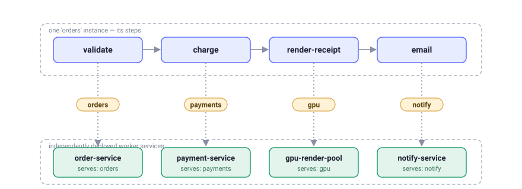
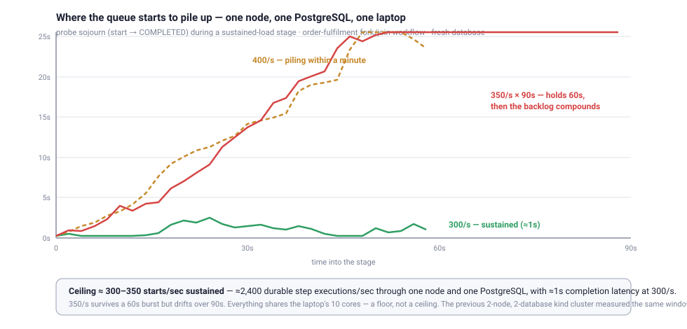

<div align="center">

# 🌀 Wiggle

### Durable workflows, cellular by design.

**Describe a process as a graph. Wiggle runs it as a durable state machine that survives
crashes, waits for humans, retries failures — and shards itself across isolated cells when
one database is no longer enough.**

[](https://central.sonatype.com/artifact/io.github.hadielmougy/wiggle-client)
[](LICENSE)

[](https://github.com/hadielmougy/wiggle-go)
[](https://github.com/hadielmougy/wiggle-python)

</div>

```java
Blueprint orders = Workflow.define("order-fulfilment")
        .step("validate")
        .gate("in-stock")
        .fork(Branch.of("payment",  s -> s.step("authorise").step("capture")),
              Branch.of("shipping", s -> s.step("reserve-stock").step("print-label")))
        .combine("merge")
        .step("notify")
        .build();
```

That's a **complete, durable, parallel workflow**. No YAML, no DSL files, no determinism rules
to memorize — a compiled graph the server owns, and plain Java methods (or Go, or Python) that
serve its steps.

---

**Contents** ·
[What is Wiggle?](#1-what-is-wiggle) ·
[Deployment options](#2-deployment--running-options) ·
[Java example](#3-example-in-java) ·
[Architecture](#4-architecture) ·
[Performance](#5-performance) ·
[Configuration](#6-configuration) ·
[Roadmap](#7-roadmap) ·
[Docs & links](#docs--links)

---

## 1. What is Wiggle?

Wiggle is a **durable workflow engine** — and the control plane to shard it. You define a
business process as pure **topology** (named steps and how they chain, branch, and rejoin);
Wiggle persists every instance as tokens moving over that graph, so a process **survives
restarts, retries, and worker death** and resumes exactly where it left off. Steps are executed
by **pull-based workers** over gRPC — your services, in your processes, in your language.

Its distinctive move is being **cellular**: a namespace becomes a *cell* — its **own database
and its own cluster** — and an optional coordinator shards work across cells with
directory-free routing and zero-migration rebalancing. Blast-radius isolation and scale-out
are built into the model, not bolted on.

**Why teams pick it:**

- 🧫 **Cellular by design** — a namespace is a cell with its own database and cluster. A
  coordinator places instances by consistent hashing over *epochs*; an instance id **carries its
  own routing** (`orders.e0.s3.01J…`). Grow by adding cells, **drain and retire** old ones.
  Physical per-tenant isolation, not just logical.
- 💾 **Durable, honestly** — every instance is DB-backed. Exactly-once dispatch, at-least-once
  execution, lease-based recovery when a worker dies mid-step.
- 🧭 **State machine, not glue code** — `step`, `gate`, `choose`, `fork`, `sleep`, signals,
  timers, sub-workflows, `doWhile`, `forEach` — a compiled graph, versioned by content hash.
  **No workflow-code determinism to get wrong**, because the workflow *is* data, not replayed code.
- 🔌 **Pull-based & polyglot** — workers long-poll over gRPC: no inbound connectivity, no broker,
  backpressure built in. Idiomatic **Java, Go, and Python** workers interoperate on one server —
  a single instance can have steps served by three languages, dispatched by activity name.
- 🪶 **Lightweight & embeddable** — the whole thing is a JAR plus a database
  (PostgreSQL / MySQL / Oracle / SQL Server, or in-memory for dev). Embed the server in your JVM
  for tests; the coordinator is **opt-in** — a single cluster runs unchanged without one. No
  Elasticsearch, no sidecar mesh, no mandatory Kubernetes.
- 🖥 **Operable from day one** — a web **ops console** (live trace of every instance over the
  workflow diagram, cancel, deliver signals, schedules, search by instance or correlation id), a
  **CLI** for the cellular control plane, `/healthz` probes, queue-lag monitoring, memory
  admission control.

In one picture — a single `orders` instance whose steps run on **different microservices**,
routed by each step's **queue**. The server keeps the durable state; each service just pulls the
steps it serves:



<sub>How queue routing works end to end → **[docs/queues.md](docs/queues.md)**</sub>

---

## 2. Deployment & running options

One codebase, four postures — start embedded, end sharded, **without rewriting your workflows**.

| Mode | What it is | When |
|---|---|---|
| **Embedded** | `WiggleServer` inside your JVM, in-memory store | dev, tests, single-process apps |
| **Standalone server** | one node, gRPC `:8080`, in-memory or a database | small services, first deploy |
| **Cluster** | several nodes on **one database** — shared queue, leader runs timers/recovery | production, HA |
| **Cellular (sharded)** | many cells (each its own DB + cluster) behind a **coordinator** | multi-tenant isolation, scale-out |

### 2.1 Embedded — one JVM, zero infrastructure

The server is a library. No database configured means an in-memory store — perfect for tests:

```java
try (WiggleServer server = new WiggleServer(ServerConfig.fromEnvironment()).start();
     WiggleClient client = new WiggleClient(server.baseUrl())) {
    // register blueprints, run workers, start instances — all in-process
}
```

### 2.2 Standalone server & cluster

```bash
./gradlew :dist:run        # single node, in-memory, gRPC on :8080
```

As a container — one image bundles **every** storage backend; the JDBC URL scheme picks one at
runtime, so you never build a per-database image:

```bash
docker run --rm -p 8080:8080 \
  -e WIGGLE_JDBC_URL=jdbc:postgresql://db:5432/wiggle \
  -e WIGGLE_JDBC_USER=wiggle -e WIGGLE_JDBC_PASSWORD=wiggle \
  hadielmougy/wiggle:2.1.7
```

**Clustering is just a shared database.** Point several nodes at one PostgreSQL and they form a
cluster: every node serves the API and hands out work; exactly one is elected leader for
clock-driven duties (timers, lease recovery, schedules). Kill any node — including the leader —
and the rest carry on. The schema creates and migrates itself on startup (versioned, forward-only
migrations under a cross-node advisory lock).

```bash
docker compose up -d postgres
scripts/cluster.sh 20            # three server nodes, two workers, one Postgres
scripts/kind-up.sh 3             # or the same on Kubernetes (kind)
```

### 2.3 Sharding & the coordinator (cellular)

When one database is no longer enough — or tenants must not share blast radius — go cellular.
A **namespace** maps to one or more **cells**; each cell is a full cluster with its **own
database**. The **coordinator** (a Raft group over embedded Ratis + RocksDB — no external store)
owns placement:

- **Placement by epochs** — a namespace's instances spread over cells by consistent hashing over
  a shard ring. Publishing a new ring is an *epoch bump*: new instances follow the new ring,
  in-flight ones finish where they live. **Resharding never migrates data.**
- **Directory-free routing** — the instance id embeds namespace, epoch, and shard
  (`orders.e0.s3.01J…`), so any party can resolve the owning cell without a lookup table.
- **One binary, three roles** — the same image runs everything, chosen by env:

```bash
WIGGLE_ROLE=coordinator WIGGLE_COORD_STORE=ratis:///var/lib/wiggle/coord  # control plane, :8099
WIGGLE_ROLE=cell WIGGLE_CELL_ID=cellA WIGGLE_NAMESPACE=orders \
  WIGGLE_COORDINATOR_URL=coordinator:8099 WIGGLE_JDBC_URL=jdbc:postgresql://dbA/wiggle  # a cell node
WIGGLE_ROLE=console WIGGLE_COORDINATOR_URL=coordinator:8099 WIGGLE_NAMESPACE=orders     # the web UI
```

Clients don't change: `WiggleConnection.direct(url)` for a single cluster,
`WiggleConnection.coordinator(url, tls, region)` for a sharded one — each returns a type that
exposes only its valid operations. A `NamespaceWorker` fans one worker out across a namespace's
live cells and follows rebalances automatically. The `wiggle` **CLI** drives the control plane:

```bash
wiggle use coordinator prod:8099
wiggle open-epoch -n orders 0=cellA 1=cellB     # publish a new shard→cell ring (a reshard)
wiggle allocations -n orders
```

<sub>The full cellular model → **[docs/sharding-and-epochs.md](docs/sharding-and-epochs.md)**</sub>

### 2.4 The ops console

A standalone web UI that is a **pure gRPC client** — the same binary works against a single
cluster (`WIGGLE_URL`) or a whole sharded namespace (`WIGGLE_COORDINATOR_URL` +
`WIGGLE_NAMESPACE`, fanning queries across the namespace's cells and routing operations to the
owning cell by instance id). Live instance trace over the workflow diagram, cancel, deliver
signals, schedules, and search by **instance id or correlation id**. Optional login with an
operator account and a **read-only viewer** account. Cells themselves serve no UI — just a
`/healthz` probe for Kubernetes.

```bash
WIGGLE_URL=localhost:8080 ./gradlew :console:run    # → http://localhost:8090
```

---

## 3. Example in Java

The fastest end-to-end: an embedded server, one worker, one instance — one JVM.

```java
import com.wiggle.client.dsl.*;
import com.wiggle.client.worker.*;
import com.wiggle.core.InstanceView;
import com.wiggle.server.*;

import java.time.Duration;
import java.util.HashMap;
import java.util.Map;

// 1. A workflow is pure topology — named steps, no logic.
Blueprint greet = Workflow.define("greet")
        .step("say-hello")
        .build();

// 2. The logic lives in a @Handlers class, matched by method name (say-hello ↔ sayHello).
@Handlers("greet")
class GreetHandlers {
    public Map<String, Object> sayHello(Map<String, Object> ctx) {
        Map<String, Object> next = new HashMap<>(ctx);
        next.put("greeting", "hello, " + ctx.get("name"));
        return next;
    }
}

// 3. Embedded server + worker + one instance.
try (WiggleServer server = new WiggleServer(ServerConfig.fromEnvironment()).start();
     WiggleClient client = new WiggleClient(server.baseUrl())) {

    try (Worker worker = new Worker(client, "worker-1")
            .register(greet).handlers(new GreetHandlers())) {
        worker.start();

        String id = client.start(greet, Map.of("name", "ada"));
        InstanceView result = client.awaitCompletion(id, Duration.ofSeconds(10));

        System.out.println(result.status());    // COMPLETED
        System.out.println(result.context());   // {name=ada, greeting=hello, ada}
    }
}
```

A real one — parallel branches, a guard, a retry policy, a server-side timer:

```java
Blueprint orders = Workflow.define("order-fulfilment")
        .step("validate")
        .gate("in-stock")                    // false ⇒ the instance ends cleanly, not an error
        .fork(
            Branch.of("payment", s -> s
                .step("authorise", RetryPolicy.exponential(5, Duration.ofMillis(100)))
                .step("capture")),
            Branch.of("shipping", s -> s
                .step("reserve-stock")
                .sleep("await-warehouse", Duration.ofMillis(300))   // no worker held while waiting
                .step("print-label")))
        .combine("merge")                    // branches ran on isolated context copies; rejoin here
        .step("notify")
        .build();
```

Handlers are plain methods — typed records or raw maps, your choice per step. The **signature
defines the step kind**: a `boolean` return is a gate, `void` is an effect, anything else is a
task whose return value becomes the new context:

```java
@Handlers("order-fulfilment")
class OrderHandlers {
    public Order   validate(Order o)     { return o.withStatus("VALIDATED"); }
    public boolean inStock(Order o)      { return o.quantity() > 0; }          // gate: "in-stock"
    public Order   authorise(Order o)    { return o.withPaymentRef("auth-" + o.orderId()); }
    public Order   reserveStock(Order o) { return o.withShipmentRef("shp-" + o.orderId()); }
    public Order   printLabel(Order o)   { return o.withTrackingLabel("DHL-" + o.orderId()); }
    public Order   capture(Order o)      { return o.log("captured"); }
    // The combine is mandatory and explicit: fold what each branch produced onto the pre-fork
    // order and return the COMPLETE post-join context — nothing merges implicitly.
    public Order   merge(@Context Order base, @Arm("payment") Order pay, @Arm("shipping") Order ship) {
        return base.withPaymentRef(pay.paymentRef())
                   .withShipmentRef(ship.shipmentRef()).withTrackingLabel(ship.trackingLabel());
    }
    public Order   notify(Order o)       { return o.withStatus("FULFILLED"); }
}
```

Dynamic fan-out is just as explicit — **the element is the item's context** (`forEach` maps
elements the way `fork` transforms contexts):

```java
.forEach("items", b -> b.step("price"))     // one isolated branch per element — scalars included
        .combine("collect")

Priced price(LineItem line) {                       // the parameter IS the element
    Order base = Step.base(Order.class);            // frozen pre-forEach context, read-only
    return new Priced(line.sku(), base.rate() * line.amount());
}
Order collect(@Context Order base, List<Priced> priced) { /* you decide what lands */ }
```

Run it from any process — different teams can serve different steps of the *same* flow, each
with its own `@Handlers` class and its own deploy, matched by name:

```java
try (DirectConnection wiggle = WiggleConnection.direct("localhost:8080")) {
    Worker worker = new Worker(wiggle.client(), "worker-1",
                    WorkerOptions.defaults().withConcurrency(16))
            .register(orders)
            .handlers(new OrderHandlers())
            .start();

    String id = wiggle.client().start(orders, Order.of("A-1001", "ada", 3, new BigDecimal("249.90")));
    InstanceView v = wiggle.client().awaitCompletion(id, Duration.ofSeconds(30));
}
```

And the parts long-running processes actually need are first-class:

```java
// Human / external input — the instance parks (no worker held), a deadline can escalate:
Workflow.define("expense")
        .step("submit")
        .awaitSignal("manager-approval", Duration.ofHours(48), b -> b.step("auto-escalate"))
        .step("pay-out")
        .build();

client.signal(instanceId, "manager-approval", Map.of("decision", "approved"));

// Cron & interval schedules — exactly-once firing, even across leader failover:
client.createCronSchedule("nightly-report", "0 3 * * *", null);

// Sub-workflows, cancellation, retries with attempt introspection:
client.cancel(id, "customer changed their mind");
```

**More runnable code:** `./gradlew :example:run` (full order demo, one JVM) ·
`./gradlew :example:runCookbook` — the **[DSL cookbook](docs/dsl-cookbook.md)**: eight
workflows exercising every operator.

---

## 4. Architecture


| Component | Module | What it does |
|---|---|---|
| **Engine (cell node)** | `server` | The durable state machine: compiles graphs, moves tokens, leases steps to workers, runs timers/signals/schedules, recovers dead workers. Clusters over a shared DB; leader-elected housekeeping. Serves gRPC `:8080` and a `/healthz` probe. |
| **Storage** | `jdbc`, `postgres`, `mysql`, `oracle`, `sqlserver` | One HikariCP-pooled, dialect-aware JDBC store; backends are drop-in modules behind an explicit `StorageFactory`. No DB configured ⇒ in-memory. |
| **Coordinator** | `coordinator` | Optional control plane: a Raft group (embedded Ratis + RocksDB — no external store) that allocates namespaces to cells, publishes epoch rings, tracks node health, and answers "where does this instance live?". |
| **Client & worker** | `client` | The DSL (`Workflow.define…`), `@Handlers` binding, `WiggleClient`, pull-based `Worker` / `NamespaceWorker`, `WiggleConnection` (direct ∣ coordinator). |
| **Ops console** | `console` | Standalone web UI (embedded Tomcat) that is a pure gRPC client — single-cluster or namespace-wide. Trace, cancel, signal, schedules, search; operator + read-only viewer auth. |
| **CLI** | `cli` | `wiggle` — coordinator administration: epochs, allocations. |
| **Distribution** | `dist` | The one runnable image: `WIGGLE_ROLE=cell ∣ coordinator ∣ console`, every storage backend bundled. |

**The mechanics that make it hold together:**

- **Tokens over a graph** — an instance is rows, not a call stack: tokens mark where execution
  is on the compiled graph. Crash-safe by construction; the console renders it live.
- **Leases, not locks** — a claimed step carries a lease; if the worker dies, the lease expires
  and the step is redelivered. At-least-once execution, exactly-once dispatch.
- **Content-hash versioning** — a definition's version *is* the hash of its graph. Re-registering
  an identical graph is a no-op; in-flight instances keep the version they started on.
- **Queues route steps** — each step can name a queue (`step("render", "gpu")`); worker pools
  subscribe to queues, so one flow's steps spread across many services with no broker.
- **Epochs, not migrations** — resharding publishes a new ring under a new epoch. New work lands
  by the new ring; old work drains in place. The id says which ring applies.
- **Local step chaining** — `LOCAL_SYNC` / `LOCAL_ASYNC` execution modes let a worker run
  consecutive same-queue steps back-to-back, cutting server round-trips for step-heavy flows
  (see [docs/local-execution.md](docs/local-execution.md)).

---

## 5. Performance

**The engine alone, one JVM** (embedded server, in-memory store, 8-step workflow, 4 workers):

| execution mode | throughput |
|---|---|
| `SERVER` (a round-trip per step) | **2,481 instances/sec** · 19.8k durable step completions/sec |
| `LOCAL_SYNC` (chained, commit per step) | 3,313 instances/sec · 26.5k steps/sec |
| `LOCAL_ASYNC` (chained, batched commits) | **11,478 instances/sec · 91.8k steps/sec** |

**A real deployment on one laptop** — the kind-based lab cluster, PostgreSQL-backed, reached
over `kubectl port-forward`. We ramp the offered start rate and watch *probe sojourn* — the
end-to-end time of a fresh instance from `start()` to `COMPLETED`. Flat sojourn means the
cluster is keeping up; monotonic growth means arrivals are outrunning it and backlog is
compounding:



| offered rate | window | end-to-end latency | verdict |
|---|---|---|---|
| **300/s** | 60s | settles **below 1s** | ✅ sustained |
| 340/s | 60s | plateau ≈4s, stable | ✅ holds a burst |
| 340/s | 90s | 4s → 24s, monotonic | ❌ queue piling |

**≈300 durable workflow starts/sec — ≈2,400 durable step executions/sec — sustained through the
cluster with sub-second completion latency**; ~340/s survives a one-minute burst before the
backlog compounds. Submit latency p50 ≈ 26ms / p99 ≈ 130ms throughout. Each instance is the
8-step `order-fulfilment` fork/join workflow (validate → gate → 2 parallel branches → explicit
combine → notify → audit, `LOCAL_ASYNC` mode), every step durably committed to PostgreSQL.

**Environment — deliberately modest, everything on one machine:**

| | |
|---|---|
| Host | MacBook Pro, Apple M2 Pro (10 cores), 16 GB RAM |
| Cluster | kind (Kubernetes-in-Docker) inside a 10-CPU / 7.7 GB Docker Desktop VM |
| Topology | 1 coordinator (Ratis) · 2 cells, **each its own server node + PostgreSQL 16** (fresh DBs) · no pod resource limits |
| Client side | submitter + 1 worker (`concurrency=100` per cell) on the host, gRPC via `kubectl port-forward` |
| Runtime | OpenJDK 21 |

Honest footnotes: the submitter, worker, Kubernetes, coordinator, cells, and databases all
share those 10 cores — a floor, not a ceiling, and the reason two cells on *one* box measure
the same as one (cells buy throughput on separate hardware; that's the point of the model).
And measured on **fresh databases** deliberately: after a day of accumulated benchmark history
(~500k retained instances) the same setup showed ~2× the latency at 300/s — retention and
purge cadence are part of capacity planning, not an afterthought.

Reproduce both (the tools ship in the repo):

```bash
./gradlew :example:bench             # the embedded engine numbers (set WIGGLE_EXECUTION_MODE)

WIGGLE_COORDINATOR_URL=… WIGGLE_NAMESPACE=… BENCH_RATES="300,340" \
  ./gradlew :example:rateCeiling     # the cluster ceiling (needs a running worker)
```

---

## 6. Configuration

Everything defaults sensibly; override by environment variable (or the same-named system
property). The tables below are the ones you'll actually touch — the **complete** reference,
including programmatic `WorkerOptions`, lives in **[docs/onboarding.md](docs/onboarding.md)**.

### Server / cell node

| Variable | Default | Meaning |
|---|---|---|
| `WIGGLE_PORT` | `8080` | gRPC port (`0` picks a free one) |
| `WIGGLE_JDBC_URL` | *(unset)* | **unset = in-memory, single node**; set to cluster on a DB. Scheme picks the backend: `jdbc:postgresql:`, `jdbc:h2:`, `jdbc:mysql:`/`jdbc:mariadb:`, `jdbc:oracle:`, `jdbc:sqlserver:` |
| `WIGGLE_JDBC_USER` / `WIGGLE_JDBC_PASSWORD` | | database credentials |
| `WIGGLE_JDBC_POOL_SIZE` | `10` | HikariCP max pool size |
| `WIGGLE_LEASE_MILLIS` | `30000` | task lease before a stalled step is reclaimed |
| `WIGGLE_LONGPOLL_MAX_MILLIS` | `20000` | max server-side block of a worker poll |
| `WIGGLE_POLL_INTERVAL_MILLIS` | `1000` | housekeeping / dispatch loop cadence |
| `WIGGLE_HOUSEKEEPING_BATCH` | `100` | timers/signals/reclaims swept per pass |
| `WIGGLE_DISPATCH_LINGER_MILLIS` | `5` | wake-on-produce batch linger (`0` = claim immediately) |
| `WIGGLE_FALLBACK_POLL_MILLIS` | `100` | long-poll fallback re-claim interval |
| `WIGGLE_HEARTBEAT_INTERVAL_MILLIS` | `5000` | node heartbeat cadence |
| `WIGGLE_MISSED_HEARTBEATS` | `3` | missed beats before a node is considered dead |
| `WIGGLE_RETENTION_MILLIS` | `86400000` | how long finished instances are kept |
| `WIGGLE_NODE_NAME` | hostname | name in cluster membership |
| `WIGGLE_NAMESPACE` | *(unset)* | the cell's namespace (cellular mode) |
| `WIGGLE_CELL_ID` / `WIGGLE_COORDINATOR_URL` / `WIGGLE_ADVERTISE_HOST` | *(unset)* | cellular wiring: this cell's id, the coordinator to announce to, and the host advertised for routing |
| `WIGGLE_DASHBOARD_PORT` | `0` (off) | port for the **`/healthz`** probe endpoint (the UI moved to the console) |
| `WIGGLE_QUEUE_LAG_CHECK_INTERVAL_MILLIS` / `WIGGLE_QUEUE_LAG_WARN_MILLIS` | `5000` / `10000` | backlog-drain monitoring; logs a WARNING when the queue isn't draining |
| `WIGGLE_MEMORY_SHEDDING_ENABLED` | `false` | memory admission control — under heap pressure, reject a fraction of polls (`WIGGLE_MEMORY_THRESHOLD` `0.90`, `WIGGLE_MEMORY_REJECT_RATIO` `0.10`, `WIGGLE_MEMORY_RETRY_MILLIS` `2000`, `WIGGLE_MEMORY_RETRY_JITTER_MILLIS` `1000`) |
| `WIGGLE_TLS_KEYSTORE` (+`_PASSWORD`) | *(unset)* | keystore ⇒ TLS on; **unset = plaintext** |
| `WIGGLE_TLS_TRUSTSTORE` (+`_PASSWORD`) | *(unset)* | truststore on a server ⇒ **require client certs (mTLS)** |
| `WIGGLE_LOG_FILE` / `WIGGLE_LOG_LEVEL` | *(unset)* / `INFO` | rotating file log (JDK `System.Logger` — zero logging deps) |

### Coordinator

| Variable | Default | Meaning |
|---|---|---|
| `WIGGLE_ROLE` | `cell` | set `coordinator` to run the control plane (no engine, no cell DB) |
| `WIGGLE_PORT` | `8080` | coordinator gRPC port (`8099` by convention) |
| `WIGGLE_COORD_STORE` | `ratis:///var/lib/wiggle/coord` | embedded Ratis+RocksDB store; multi-node: `ratis://<dir>?peers=id0@host:port,…&id=<self>` |
| `WIGGLE_MISSED_HEARTBEATS` / `WIGGLE_NODE_NAME` / `WIGGLE_TLS_*` | as above | shared knobs |

### Ops console

| Variable | Default | Meaning |
|---|---|---|
| `WIGGLE_URL` | `localhost:8080` | direct mode: the one cluster to serve |
| `WIGGLE_COORDINATOR_URL` + `WIGGLE_NAMESPACE` (+ `WIGGLE_REGION`) | *(unset)* | coordinator mode: fan queries across the namespace's cells, route ops by instance id |
| `WIGGLE_DASHBOARD_PORT` | `8090` | HTTP port |
| `WIGGLE_DASHBOARD_USER` / `WIGGLE_DASHBOARD_PASSWORD` | `admin` / *(unset)* | operator login; **unset = open access** |
| `WIGGLE_DASHBOARD_VIEWER_USER` / `WIGGLE_DASHBOARD_VIEWER_PASSWORD` | `viewer` / *(unset)* | optional **read-only** account — sees everything, can't cancel/signal/schedule |
| `WIGGLE_TLS_*` | *(unset)* | HTTPS + the client certs it presents to cells |

> **Security posture in one line:** TLS everywhere is a keystore away; a truststore on the server
> upgrades it to mTLS; the console adds operator/viewer authorization. TLS authenticates the
> connection — per-RPC authorization is on the [roadmap](#7-roadmap).

---

## 7. Roadmap

Where it's going — the honest list:

- [ ] **Console: topology view** — namespaces → cells → epochs/ring/roster, live placement
      visualization; multi-namespace switcher.
- [ ] **Pending-signals over gRPC** — enumerate parked signal waits from the console in
      coordinator mode (a `PendingSignals` RPC).
- [ ] **Cross-cell pagination** — globally sorted instance listing across a namespace's cells.
- [ ] **Per-RPC authorization** — identity-based (client-certificate) allow-listing and role
      separation on the control plane itself; SSO for the console.
- [ ] **Compensation helpers** — first-class saga/compensation patterns (today a failed instance
      stops; it does not roll back).
- [ ] **Buffered signals** — deliver-before-wait semantics as an option (today a signal is
      rejected unless the instance is already waiting on it).
- [ ] **Richer wire tokens** — queue / lease-expiry / updated-at on the gRPC token detail.
- [ ] **Stable cell DNS** — coordinator provisioning records a stable per-cell address instead
      of a node endpoint.

Suggestions and PRs welcome — open an issue.

---

## Docs & links

| | |
|---|---|
| 🚀 **[Onboarding + full configuration reference](docs/onboarding.md)** | everything, one page |
| 🧑‍🍳 **[DSL cookbook](docs/dsl-cookbook.md)** | every operator in runnable code — `./gradlew :example:runCookbook` |
| 🧵 **[Queues](docs/queues.md)** | one flow's steps across many microservices |
| 🧫 **[Sharding & epochs](docs/sharding-and-epochs.md)** | the cellular model in depth |
| ⚡ **[Local execution](docs/local-execution.md)** | `LOCAL_SYNC` / `LOCAL_ASYNC` step chaining |
| 📽 **[Slide deck](https://hadielmougy.github.io/wiggle/presentation.html)** | the 5-minute tour |
| 🐍 **[wiggle-python](https://github.com/hadielmougy/wiggle-python)** · 🐹 **[wiggle-go](https://github.com/hadielmougy/wiggle-go)** | idiomatic clients, same control plane |

**Install** (Maven Central, `io.github.hadielmougy`):

```kotlin
implementation("io.github.hadielmougy:wiggle-client:2.1.7")     // DSL + worker + client
implementation("io.github.hadielmougy:wiggle-server:2.1.7")     // only to embed the server
implementation("io.github.hadielmougy:wiggle-postgres:2.1.7")   // + your storage module
```

**Build from source** — JDK 21+, wrapper included:

```bash
./gradlew build        # full build + tests
./gradlew :example:run # see it work
```

<div align="center">
<sub>Apache-2.0 · built with care for processes that must not lose their place.</sub>
</div>
