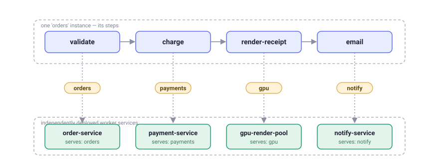
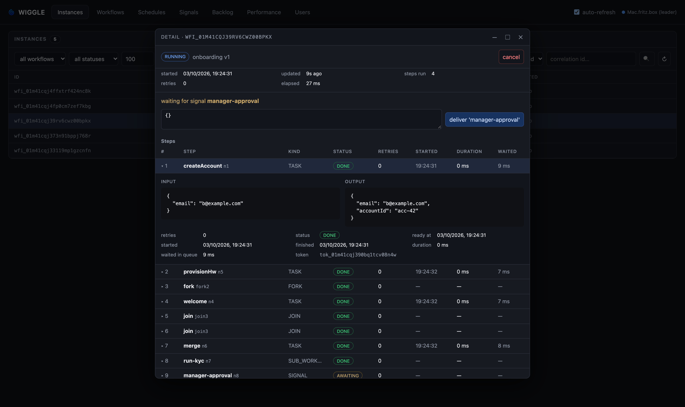
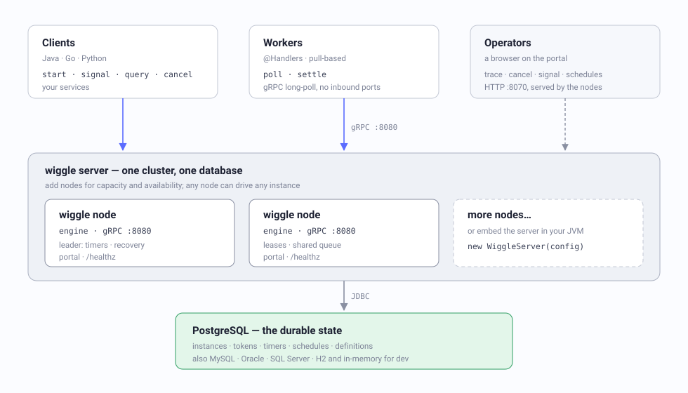
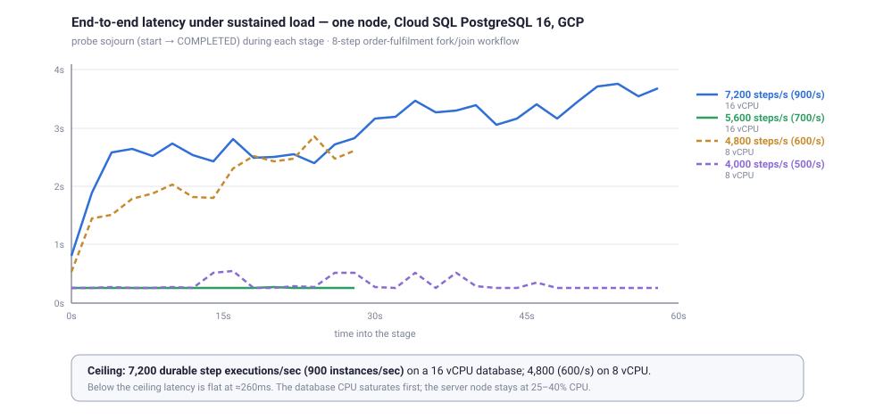
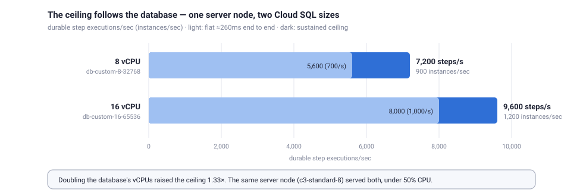

<div align="center">

<picture>
  <source media="(prefers-color-scheme: dark)" srcset="docs/img/wiggle-logo-dark.svg">
  
</picture>

### Durable workflows. 

**Describe a process as a graph. Wiggle runs it as a durable state machine that survives
crashes, waits for humans, and retries failures — with a server you can embed, and workers in
the language you already use.**

[](https://central.sonatype.com/artifact/sh.wiggle/wiggle-client)
[](https://hub.docker.com/r/hadielmougy/wiggle)
[](https://github.com/hadielmougy/wiggle/pkgs/container/wiggle)
[](LICENSE)

[](https://github.com/hadielmougy/wiggle-go)
[](https://github.com/hadielmougy/wiggle-python)

</div>

```java
interface OrderSteps {                                  // the steps, as a contract
    Order   validate(Order o);
    boolean inStock(Order o);
    Order   authorise(Order o);
    ...
}

FlowSpec orders = FlowSpec.define("order-fulfilment", 1, Order.class, OrderSteps.class, (f, s) -> {
    var validated = f.thenApply(s::validate).thenFilter(s::inStock);

    var payment  = validated.thenApply(s::authorise).thenApply(s::capture);
    var shipping = validated.thenApply(s::reserveStock).thenApply(s::printLabel);

    return Wiggle.allOf(payment, shipping)          // both arms run, on isolated context copies
            .combineWithContext(s::merge)           // and rejoin explicitly
            .thenApply(s::notify);
});
```

That's a **complete, durable, parallel workflow**. No YAML, no DSL files, no determinism rules
to memorize — a compiled graph the server owns, and plain Java methods (or Go, or Python) that
serve its steps.

A spec **names** its steps; it never runs them — the code is bound by name on a worker. So the steps
are declared as an interface and named through it, which is why the compiler can check that each step
consumes what the one before it produced. A handler that `implements OrderSteps` is then checked
against the same contract, so the two halves cannot drift. Continuing `validated` twice is what makes
the two parallel arms.

---

**Contents** ·
[What is Wiggle?](#1-what-is-wiggle) ·
[Deployment options](#2-deployment--running-options) ·
[Java example](#3-example-in-java) ·
[Architecture](#4-architecture) ·
[Performance](#5-performance) ·
[Configuration](#6-configuration) ·
[Roadmap](#7-roadmap) ·
[Docs & links](#docs--links)

---

## 1. What is Wiggle?

Wiggle is a **durable workflow engine**: a JAR and a database. You define a
business process as pure **topology** (named steps and how they chain, branch, and rejoin);
Wiggle persists every instance as tokens moving over that graph, so a process **survives
restarts, retries, and worker death** and resumes exactly where it left off. Steps are executed
by **pull-based workers** over gRPC — your services, in your processes, in your language.

Its distinctive move is that the workflow **is data**: a compiled graph the server walks, not
replayed code. So there is no determinism discipline to get wrong, and a running process can be
inspected, traced and versioned like any other row in your database.

**Why teams pick it:**

- 💾 **Durable, honestly** — every instance is DB-backed. Exactly-once dispatch, at-least-once
  execution, lease-based recovery when a worker dies mid-step.
- 🧭 **State machine, not glue code** — `step`, `gate`, `choose`, `fork`, `sleep`, signals,
  timers, sub-flows, `repeatWhile`, `thenForEach` — a compiled graph, published at a version you declare.
  **No workflow-code determinism to get wrong**, because the workflow *is* data, not replayed code.
- 🔌 **Pull-based & polyglot** — workers long-poll over gRPC: no inbound connectivity, no broker,
  backpressure built in. Idiomatic **Java, Go, and Python** workers interoperate on one server —
  a single instance can have steps served by three languages, dispatched by activity name.
- 🪶 **Lightweight & embeddable** — the whole thing is a JAR plus a database
  (PostgreSQL, or in-memory for dev). Embed the server in your JVM for tests, or run it as one
  process beside your services. No Elasticsearch, no sidecar mesh, no mandatory Kubernetes.
- 🖥 **Operable from day one** — a web **ops console** (every instance step by step — each
  step's input, output, retries and timing — cancel, deliver signals, schedules, search by
  instance or correlation id, per-step latency and queue wait), `/healthz` probes, queue-lag monitoring, memory admission control.
- 🔍 **Governs steps you run yourself, too** — `OBSERVED` mode: your services report the steps
  they completed against a published topology, and the server checks every run for conformance
  (out of order, duplicate, incomplete, stalled) and ranks the bottlenecks — no worker, no
  dispatch, nothing waits on the server.

In one picture — a single `orders` instance whose steps run on **different microservices**,
routed by each step's **queue**. The server keeps the durable state; each service just pulls the
steps it serves:



<sub>How queue routing works end to end → **[docs/queues.md](docs/queues.md)**</sub>

---

## 2. Deployment & running options

One codebase, three postures — start embedded, grow into a cluster, **without rewriting your workflows**.

| Mode | What it is |
|---|---|
| **Embedded** | `WiggleServer` inside your JVM, in-memory or DB store |
| **Standalone server** | one node, gRPC `:8080`, in-memory or a database |
| **Cluster** | several nodes on **one database** — shared queue, leader runs timers/recovery |

### 2.1 Embedded — one JVM, zero infrastructure

The server is a library. No database configured means an in-memory store — perfect for tests:

```java
try (WiggleServer server = new WiggleServer(ServerConfig.fromEnvironment()).start();
     WiggleClient client = new WiggleClient(server.baseUrl())) {
    // register flow specs, run workers, start instances — all in-process
}
```

### 2.2 Standalone server & cluster

```bash
./gradlew :dist:run        # single node, in-memory, gRPC on :8080
```

Or **download the pre-built distribution** from the [GitHub release](https://github.com/hadielmougy/wiggle/releases)
and run it directly — no build, no Maven, no registry, just a JRE 21 (ideal for airgapped or
locked-down environments). Each release attaches `wiggle-server-<version>.tar`/`.zip` plus a signed
`SHA-256SUMS`:

```bash
tar xf wiggle-server-0.0.9.tar
sha256sum -c SHA-256SUMS           # optional: verify the download
WIGGLE_JDBC_URL=jdbc:postgresql://db:5432/wiggle \
  WIGGLE_JDBC_USER=wiggle WIGGLE_JDBC_PASSWORD=wiggle \
  ./wiggle-server-0.0.9/bin/wiggle
```

As a container — one image bundles **every** storage backend; the JDBC URL scheme picks one at
runtime, so you never build a per-database image. The signed, multi-arch (amd64 + arm64) image is
published to **both Docker Hub and GitHub Container Registry** — pull from whichever your
environment prefers:

```bash
docker run --rm -p 8080:8080 \
  -e WIGGLE_JDBC_URL=jdbc:postgresql://db:5432/wiggle \
  -e WIGGLE_JDBC_USER=wiggle -e WIGGLE_JDBC_PASSWORD=wiggle \
  hadielmougy/wiggle:0.0.9                 # Docker Hub
  # ghcr.io/hadielmougy/wiggle:0.0.9       # …or GHCR (same image)
```

**Clustering is just a shared database.** Point several nodes at one PostgreSQL and they form a
cluster: every node serves the API and hands out work; exactly one is elected leader for
clock-driven duties (timers, lease recovery, schedules). Kill any node — including the leader —
and the rest carry on. The schema creates and migrates itself on startup (versioned, forward-only
migrations under a cross-node advisory lock).

```bash
docker compose up -d postgres
scripts/cluster.sh 20            # three server nodes, two workers, one Postgres
scripts/kind-up.sh 3             # or the same on Kubernetes (kind)
```

On a real cluster, the [Helm chart](deploy/helm/wiggle) deploys a hardened, non-root pod (distroless
image, read-only root filesystem, all capabilities dropped — passes a *restricted* PodSecurity
namespace unmodified). Point `image.registry` at your internal registry and you're done:

```bash
helm install wiggle deploy/helm/wiggle \
  --set image.registry=artifactory.example.com \
  --set storage.jdbc.url=jdbc:postgresql://postgres:5432/wiggle \
  --set storage.jdbc.user=wiggle --set storage.jdbc.password=secret \
  --set replicaCount=3
```

### 2.3 The ops console

A standalone web UI that is a **pure gRPC client** — point it at a cluster with `WIGGLE_URL`.
Every instance as a table of the steps it ran — click a step to expand its **input, output,
retries and timing** — plus cancel, deliver signals, schedules, and search by
**instance id or correlation id**. Optional login with an operator account and a **read-only
viewer** account, and an admin can add further accounts of either role from the console itself,
each able to change its own password. Server nodes themselves serve no UI — just a `/healthz`
probe for Kubernetes.



The **Performance** tab reads the same timings for every execution mode: each step's p50/p95
by the handler's own clock, how long it waited to be claimed, slowest first, and the anomalies of
observed runs ([§2.4](#24-observed-execution--governing-steps-you-run-yourself)).


```bash
WIGGLE_URL=localhost:8080 ./gradlew :console:run    # → http://localhost:8090
./gradlew :example:seedDashboard                    # a seeded server to point it at (:8080)
./gradlew :example:seedObserved                     # …or one with sixty observed checkout runs
```

### 2.4 Observed execution — governing steps you run yourself

Not every process wants a workflow engine in its call path. In **`OBSERVED`** mode the server
dispatches nothing: your services run their own steps, on their own threads, and report each
completed step with a **correlation key** and its **start and finish**. The server appends
reports to the run the key names, and once the run settles it judges it against the declared
topology, records every departure as an **anomaly** rather than refusing it, and keeps the
timings that feed the Performance tab.

```java
FlowSpec spec = FlowSpec.define("checkout", 1, Order.class, CheckoutSteps.class, (f, s) -> f
        .thenApply(s::validate)
        .thenFilter(s::inStock)
        .thenApply(s::charge));   // no execution mode: an observer stamps OBSERVED when it publishes

try (Observer observer = Observer.connect("localhost:8080")) {
    ObservedFlow checkout = observer.publish(spec);        // stamps OBSERVED, registers, validates names

    checkout.record(orderId, "validate", startedAt, finishedAt);
    checkout.recordPredicate(orderId, "inStock", true, startedAt, finishedAt);
    checkout.recordError(orderId, "charge", "CardDeclined", startedAt, finishedAt);
}
```

The reporter lives in its own module, `sh.wiggle:wiggle-observe`, and never blocks the caller:
reports queue on one flusher thread and travel in batches. Several services can report steps of
the same run, keyed by the same correlation id, and the server pieces the run together.

<sub>Anomaly kinds, settle rules, and the wire protocol → **[docs/observed-execution.md](docs/observed-execution.md)**</sub>

---

## 3. Example in Java

The fastest end-to-end: an embedded server, one worker, one instance — one JVM.

```java
import com.wiggle.client.flow.*;
import com.wiggle.client.worker.*;
import com.wiggle.core.InstanceView;
import com.wiggle.server.*;

import java.time.Duration;
import java.util.HashMap;
import java.util.Map;

// 1. The logic lives in a @ForFlow class. The signature defines the step.
@ForFlow("greet")
class GreetHandlers implements GreetSteps {
    public Map<String, Object> sayHello(Map<String, Object> ctx) {
        Map<String, Object> next = new HashMap<>(ctx);
        next.put("greeting", "hello, " + ctx.get("name"));
        return next;
    }
}

// 2. The workflow names its steps through a contract. Nothing runs here -- the chain is walked
//    once and compiled to a graph; the code that runs each step is bound by name on the worker.
interface GreetSteps { Map<String, Object> sayHello(Map<String, Object> ctx); }

FlowSpec greet = FlowSpec.define("greet", 1, Map.class, GreetSteps.class, (f, s) -> f.thenApply(s::sayHello));

// 3. Embedded server + worker + one instance.
try (WiggleServer server = new WiggleServer(ServerConfig.fromEnvironment()).start();
     WiggleClient client = new WiggleClient(server.baseUrl())) {

    try (Worker worker = new Worker(client, "worker-1")
            .registerHandler(new GreetHandlers())) {
        worker.start();

        String id = client.start(greet, Map.of("name", "ada"));
        InstanceView result = client.awaitCompletion(id, Duration.ofSeconds(10));

        System.out.println(result.status());    // COMPLETED
        System.out.println(result.context());   // {name=ada, greeting=hello, ada}
    }
}
```

A real one — parallel branches, a guard, a retry policy, a server-side timer:

```java
FlowSpec orders = FlowSpec.define("order-fulfilment", 1, Order.class, OrderSteps.class, (f, s) -> {
    var validated = f.thenApply(s::validate)
            .thenFilter(s::inStock);         // false ⇒ the instance ends cleanly, not an error

    var payment = validated
            .thenApply(s::authorise, RetryPolicy.exponential(5, Duration.ofMillis(100)))
            .thenApply(s::capture);

    var shipping = validated
            .thenApply(s::reserveStock)
            .thenSleep("await-warehouse", Duration.ofMillis(300))   // no worker held while waiting
            .thenApply(s::printLabel);

    return Wiggle.allOf(payment, shipping)   // arms ran on isolated context copies...
            .combineWithContext(s::merge)    // ...so rejoining them is explicit, never implicit
            .thenApply(s::notify);
});
```

### Topology without handlers

Sometimes the graph is written where its handlers are not — an author registering it with no
handler classes on its classpath, or several independent workers that each bind a subset of the
steps by name. Nothing changes: a spec never holds a handler, only the step's *name*, so the
interface it names them through is a declaration you need not implement.

```java
public interface OrderSteps {                     // declared here, implemented elsewhere
    Order   validate(Order o);
    boolean inStock(Order o);
    Order   authorise(Order o);
    // ...
}

// the author registers the topology without implementing a single step
FlowSpec orders = FlowSpec.define("order-fulfilment", 1, Order.class, OrderSteps.class, (f, s) -> { … });
```

That is what lets one workflow be served by workers in Java, Go and Python without any of them
redefining it. A worker that *does* have the handlers can implement the interface and let the
compiler check that every step matches.

Handlers are plain methods — typed records or raw maps, your choice per step. The **signature
defines the step kind**: a `boolean` return is a gate, `void` is an effect, anything else is a
task whose return value becomes the new context:

```java
@ForFlow("order-fulfilment")
class OrderHandlers {
    public Order   validate(Order o)     { return o.withStatus("VALIDATED"); }
    public boolean inStock(Order o)      { return o.quantity() > 0; }          // gate: "in-stock"
    public Order   authorise(Order o)    { return o.withPaymentRef("auth-" + o.orderId()); }
    public Order   reserveStock(Order o) { return o.withShipmentRef("shp-" + o.orderId()); }
    public Order   printLabel(Order o)   { return o.withTrackingLabel("DHL-" + o.orderId()); }
    public Order   capture(Order o)      { return o.log("captured"); }
    // The combine is mandatory and explicit: fold what each branch produced onto the pre-fork
    // order and return the COMPLETE post-join context — nothing merges implicitly.
    public Order   merge(@Context Order base, Order payment, Order shipping) {   // arms, in fork order
        return base.withPaymentRef(pay.paymentRef())
                   .withShipmentRef(ship.shipmentRef()).withTrackingLabel(ship.trackingLabel());
    }
    public Order   notify(Order o)       { return o.withStatus("FULFILLED"); }
}
```

Dynamic fan-out is just as explicit — **the element is the item's context** (`forEach` maps
elements the way `fork` transforms contexts):

```java
.thenForEach(Order::items, item -> item.thenApply(s::price))   // one isolated branch per element
        .combine(s::collect) 

Priced price(LineItem line) {                       // the parameter IS the element
    Order base = Step.base(Order.class);            // frozen pre-forEach context, read-only
    return new Priced(line.sku(), base.rate() * line.amount());
}
Order collect(@Context Order base, List<Priced> priced) { /* you decide what lands */ }
```

Run it from any process — different teams can serve different steps of the *same* flow, each
with its own `@ForFlow` class and its own deploy, matched by name:

```java
try (DirectConnection wiggle = WiggleConnection.direct("localhost:8080")) {
    Worker worker = new Worker(wiggle.client(), "worker-1",
                    WorkerOptions.defaults().withConcurrency(16))
            .register(orders)
            .registerHandler(new OrderHandlers())
            .start();

    String id = wiggle.client().start(orders, Order.of("A-1001", "ada", 3, new BigDecimal("249.90")));
    InstanceView v = wiggle.client().awaitCompletion(id, Duration.ofSeconds(30));
}
```

A team that only *starts* workflows needs none of that — no FlowSpec, no shared jar. The graph
is data the server owns, so a submitter's whole contract is the workflow **name** plus the agreed
context shape (exactly the coupling of calling an HTTP API). Registration ships with the worker
artifact — the handlers and the graph they serve deploy as one atomic act:

```java
// a separate submitting service: name + context, nothing else
String id = client.start("order-fulfilment", Map.of("orderId", "A-1001", "quantity", 3L));

// pin a version to be immune to mid-deploy definition changes (unpinned = latest)
String id2 = client.start("order-fulfilment", ctx, 302800684, "corr-42");
```

And the parts long-running processes actually need are first-class:

```java
// Human / external input — the instance parks (no worker held), a deadline can escalate:
FlowSpec.define("expense", 1, Expense.class, ExpenseSteps.class, (f, s) -> f
        .thenApply(s::submit)
        .thenAwait("manager-approval", Duration.ofHours(48), b -> b.thenApply(s::autoEscalate))
        .thenApply(s::payOut));

client.signal(instanceId, "manager-approval", Map.of("decision", "approved"));

// Cron & interval schedules — exactly-once firing, even across leader failover:
client.createCronSchedule("nightly-report", "0 3 * * *", null);

// Sub-workflows, cancellation, retries with attempt introspection:
client.cancel(id, "customer changed their mind");
```

**More runnable code:** `./gradlew :example:run` (full order demo, one JVM) · the
**[cookbook](docs/cookbook.md)** — eight workflows exercising every operator, runnable:
`./gradlew :example:runCookbook`
([source](example/src/main/java/com/wiggle/cookbook/Cookbook.java)).
The same eight graphs either way — worth reading side by side, since the typed one is a single
class per recipe where the other is a topology file plus a handlers file.

---

## 4. Architecture



| Component | Module | What it does |
|---|---|---|
| **Engine (server)** | `server` | The durable state machine: compiles graphs, moves tokens, leases steps to workers, runs timers/signals/schedules, recovers dead workers. Clusters over a shared DB; leader-elected housekeeping. Serves gRPC `:8080` and a `/healthz` probe. |
| **Storage** | `jdbc`, `postgres` | One HikariCP-pooled JDBC store behind an explicit `StorageFactory`: PostgreSQL to deploy on, H2 for tests and local runs. No DB configured ⇒ in-memory. |
| **Client & worker** | `client` | Workflow authoring (`FlowSpec.define`), `@ForFlow` binding, `WiggleClient`, pull-based `Worker`, `WiggleConnection`. |
| **Ops console** | `console` | Standalone web UI (embedded Tomcat) that is a pure gRPC client. Trace, cancel, signal, schedules, search; operator + read-only viewer auth. |
| **Distribution** | `dist` | The one runnable image: `WIGGLE_ROLE=server ∣ console`, every storage backend bundled. |

**The mechanics that make it hold together:**

- **Tokens over a graph** — an instance is rows, not a call stack: tokens mark where execution
  is on the compiled graph. Crash-safe by construction; the console renders it live.
- **Leases, not locks** — a claimed step carries a lease; if the worker dies, the lease expires
  and the step is redelivered. At-least-once execution, exactly-once dispatch.
- **Declared, immutable versions** — you publish a topology at a version you choose
  (`define("orders", 2, …)`). Re-registering the same graph is a no-op; re-registering a *changed*
  one under a published version is refused, so a forgotten bump is a deploy-time error rather than a
  graph swapped under running instances. In-flight instances keep the version they started on.
- **Queues route steps** — each step can name a queue (`step("render", "gpu")`); worker pools
  subscribe to queues, so one flow's steps spread across many services with no broker.
- **Local step chaining** — `LOCAL_SYNC` / `LOCAL_ASYNC` execution modes let a worker run
  consecutive same-queue steps back-to-back, cutting server round-trips for step-heavy flows
  (see [docs/local-execution.md](docs/local-execution.md)).
- **Observed execution** — `OBSERVED` mode turns the server into a conformance and timing
  monitor for steps that run inside your own services: each service reports the steps it
  completed by run key, step name and times; the server checks the run against the declared
  topology, records anomalies, and keeps per-step p50/p95
  (see [docs/observed-execution.md](docs/observed-execution.md)).

---

## 5. Performance

**7,200 durable step executions/sec (900 workflow instances/sec)**, sustained by one server node on
Cloud SQL for PostgreSQL. Every step is committed to the database, and each instance completes in
about 3 seconds end to end. At lighter load the end-to-end time is about 260ms: 5,600 steps/sec
(700 instances/sec) holds flat with no backlog.

Each instance is the 8-step `order-fulfilment` fork/join workflow: validate, a stock gate, two
parallel branches, an explicit combine, notify and audit. It runs in `LOCAL_ASYNC` mode. The bench
ramps the offered start rate and measures *probe sojourn*: the time a fresh instance takes from
`start()` to `COMPLETED`. The ceiling is the highest load at which sojourn stays bounded.

| Cloud SQL | sustained load | window | end-to-end latency |
|---|---|---|---|
| 8 vCPU | 4,000 steps/s (500/s) | 60s | flat **≈260ms** |
| 8 vCPU | **4,800 steps/s (600/s)**, the ceiling | 30s | ≈2.5s |
| 16 vCPU | 5,600 steps/s (700/s) | 30s | flat **≈260ms** |
| 16 vCPU | **7,200 steps/s (900/s)**, the ceiling | 60s | ≈2.5–3.7s |





**The database sets the ceiling, not the server.** At the ceiling, Cloud SQL ran at ≈90% CPU
(8 vCPU) and ≈75% (16 vCPU). The server node stayed at 25–40% CPU and the workers had headroom.
Under load the same statements slowed 4–5×: a `wf_token` update went from 0.4ms to 2ms. Doubling
the database's vCPUs raised the ceiling 1.5×. Adding server nodes on the same database would not
raise it.

**Size the connection pool to the load.** With `WIGGLE_JDBC_POOL_SIZE=32` (the default is 10),
starts queued for a connection at ≈561/s while the server and database CPUs still had headroom.
One instance makes ≈45 SQL statements, so at 600/s about 25 connections are busy at once.
Raising the pool to 128 removed the limit.

**Environment:**

| | |
|---|---|
| Region | GCP `us-central1-a`. Everything is in one zone, on a private VPC. |
| Database | Cloud SQL Enterprise, PostgreSQL 16, zonal (no HA standby), 250 GB SSD, `db-custom-8-32768` and `db-custom-16-65536` |
| Server | 1 node, `c3-standard-8`, `WIGGLE_JDBC_POOL_SIZE=128`, default settings otherwise |
| Workers | own `c3-standard-8`: 4 processes × 256 slots, `LOCAL_ASYNC` batch 64 |
| Load generator | own `c3-standard-8`: `RateCeilingBench`, 256 submitter threads |
| Build | revision `dc7022c`, OpenJDK 21, fresh database |

A regional (HA) Cloud SQL instance adds a synchronous standby to every commit, so expect a lower
ceiling there.

Reproduce it end to end. The script provisions the environment, deploys a revision, runs the
ladder, and collects `pg_stat_statements`, per-VM CPU and a server JFR:

```bash
export GCP_PROJECT=<sandbox-project>
deploy/gcp/ceiling.sh up && deploy/gcp/ceiling.sh deploy && deploy/gcp/ceiling.sh run
deploy/gcp/ceiling.sh down
```

See [deploy/gcp/README.md](deploy/gcp/README.md) for every knob.

---

## 6. Configuration

Everything defaults sensibly; override by environment variable (or the same-named system
property). The tables below are the ones you'll actually touch — the **complete** reference,
including programmatic `WorkerOptions`, lives in **[docs/onboarding.md](docs/onboarding.md)**.

### Server node

| Variable | Default | Meaning |
|---|---|---|
| `WIGGLE_PORT` | `8080` | gRPC port (`0` picks a free one) |
| `WIGGLE_JDBC_URL` | *(unset)* | **unset = in-memory, single node**; set to cluster on a DB. Scheme picks the backend: `jdbc:postgresql:` to deploy on, `jdbc:h2:` for tests and local runs |
| `WIGGLE_JDBC_USER` / `WIGGLE_JDBC_PASSWORD` | | database credentials |
| `WIGGLE_SCHEMA_MODE` | `apply` | `apply` runs pending migrations on startup; `verify` applies nothing and fails fast if the schema is behind or has drifted (DBA/CI-owned schema) |
| `WIGGLE_MIGRATE_ONLY` | `false` | `true` = apply migrations and exit (a one-shot job; then run the app with `WIGGLE_SCHEMA_MODE=verify`) |
| `WIGGLE_JDBC_POOL_SIZE` | `10` | HikariCP max pool size |
| `WIGGLE_JDBC_TX_ATTEMPTS` | `3` | replays for a transaction that rolled back on a momentary database failure; `1` disables |
| `WIGGLE_LEASE_MILLIS` | `30000` | task lease before a stalled step is reclaimed |
| `WIGGLE_RECORD_STEP_IO` | `true` | record each step's input and output for the console (`false` turns it off) |
| `WIGGLE_STEP_IO_MAX_CHARS` | `65536` | cap per recorded input/output; longer ones keep their first 4096 characters |
| `WIGGLE_LONGPOLL_MAX_MILLIS` | `20000` | max server-side block of a worker poll |
| `WIGGLE_POLL_INTERVAL_MILLIS` | `1000` | housekeeping / dispatch loop cadence |
| `WIGGLE_HOUSEKEEPING_BATCH` | `100` | timers/signals/reclaims swept per pass |
| `WIGGLE_DISPATCH_LINGER_MILLIS` | `5` | wake-on-produce batch linger (`0` = claim immediately) |
| `WIGGLE_FALLBACK_POLL_MILLIS` | `100` | long-poll fallback re-claim interval |
| `WIGGLE_HEARTBEAT_INTERVAL_MILLIS` | `5000` | node heartbeat cadence |
| `WIGGLE_MISSED_HEARTBEATS` | `3` | missed beats before a node is considered dead |
| `WIGGLE_RETENTION_MILLIS` | `86400000` | how long finished instances are kept |
| `WIGGLE_NODE_NAME` | hostname | name in cluster membership |
| `WIGGLE_DASHBOARD_PORT` | `0` (off) | port for the **`/healthz`** probe endpoint (the UI moved to the console) |
| `WIGGLE_QUEUE_LAG_CHECK_INTERVAL_MILLIS` / `WIGGLE_QUEUE_LAG_WARN_MILLIS` | `5000` / `10000` | backlog-drain monitoring; logs a WARNING when the queue isn't draining |
| `WIGGLE_ALLOW_GRAPH_REPLACE` | `false` | development only — honour `register(spec, force)` and replace the graph of an already published version instead of rejecting it |
| `WIGGLE_MEMORY_SHEDDING_ENABLED` | `false` | memory admission control — under heap pressure, reject a fraction of polls (`WIGGLE_MEMORY_THRESHOLD` `0.90`, `WIGGLE_MEMORY_REJECT_RATIO` `0.10`, `WIGGLE_MEMORY_RETRY_MILLIS` `2000`, `WIGGLE_MEMORY_RETRY_JITTER_MILLIS` `1000`) |
| `WIGGLE_TLS_KEYSTORE` (+`_PASSWORD`) | *(unset)* | keystore ⇒ TLS on; **unset = plaintext** |
| `WIGGLE_TLS_TRUSTSTORE` (+`_PASSWORD`) | *(unset)* | truststore on a server ⇒ **require client certs (mTLS)** |
| `WIGGLE_LOG_FILE` / `WIGGLE_LOG_LEVEL` | *(unset)* / `INFO` | rotating file log (JDK `System.Logger` — zero logging deps) |

### Ops console

| Variable | Default | Meaning |
|---|---|---|
| `WIGGLE_URL` | `localhost:8080` | the cluster to serve |
| `WIGGLE_DASHBOARD_PORT` | `8090` | HTTP port |
| `WIGGLE_DASHBOARD_USER` / `WIGGLE_DASHBOARD_PASSWORD` | `admin` / *(unset)* | operator login; **unset = open access** |
| `WIGGLE_DASHBOARD_VIEWER_USER` / `WIGGLE_DASHBOARD_VIEWER_PASSWORD` | `viewer` / *(unset)* | optional **read-only** account — sees everything, can't cancel/signal/schedule |
| `WIGGLE_TLS_*` | *(unset)* | HTTPS + the client certs it presents to the server |

> **Security posture in one line:** TLS everywhere is a keystore away; a truststore on the server
> upgrades it to mTLS; the console adds operator/viewer authorization. TLS authenticates the
> connection — per-RPC authorization is on the [roadmap](#7-roadmap).

---

## 7. Roadmap

Where it's going — the honest list:

- [ ] **Pending-signals over gRPC** — enumerate parked signal waits from the console
      (a `PendingSignals` RPC).
- [ ] **Per-RPC authorization** — identity-based (client-certificate) allow-listing and role
      separation on the control plane itself; SSO for the console.
- [x] **Compensation helpers** — first-class saga/compensation patterns (today a failed instance
      stops; it does not roll back).
- [x] **Observed execution** — a published topology your services report against; conformance
      anomalies and per-step latency without a worker in the path.
- [x] **Worker-reported timings** — every execution mode lands in the same Performance view,
      by the handler's own clock, with queue wait.
- [x] **Event log** — durable lifecycle events with a pull-and-ack feed, so other systems can
      react to what the engine decided ([docs/event-log.md](docs/event-log.md)).
- [x] **Handler-emitted events** — `Step.emit` on the event log, committed with the step that
      emitted it.
- [ ] **Observed-run ingest beyond the API** — event-broker adapters (correlation in Kafka
      headers), method instrumentation, and OpenTelemetry spans as reports.
- [ ] **Worker-mode anomalies** — retry exhausted, lease reclaimed, and loop budget hit,
      recorded next to the observed kinds.
- [ ] **Buffered signals** — deliver-before-wait semantics as an option (today a signal is
      rejected unless the instance is already waiting on it).
- [ ] **Richer wire tokens** — queue / lease-expiry / updated-at on the gRPC token detail.

Suggestions and PRs welcome — open an issue.

---

## Docs & links

| | |
|---|---|
| 🚀 **[Onboarding + full configuration reference](docs/onboarding.md)** | everything, one page |
| 🧑‍🍳 **[Cookbook](docs/cookbook.md)** | every operator in runnable code — `./gradlew :example:runCookbook` |
| 🧵 **[Queues](docs/queues.md)** | one flow's steps across many microservices |
| ⚡ **[Local execution](docs/local-execution.md)** | `LOCAL_SYNC` / `LOCAL_ASYNC` step chaining |
| 🔍 **[Observed execution](docs/observed-execution.md)** | `OBSERVED` mode + `wiggle-observe`: conformance + bottlenecks for steps you run yourself |
| 📨 **[Event log](docs/event-log.md)** | durable lifecycle and handler-emitted events, pulled and acknowledged by named consumers |
| 📽 **[Slide deck](https://hadielmougy.github.io/wiggle/presentation.html)** | the 5-minute tour |
| 🐍 **[wiggle-python](https://github.com/hadielmougy/wiggle-python)** · 🐹 **[wiggle-go](https://github.com/hadielmougy/wiggle-go)** | idiomatic clients, same control plane |

**Install** (Maven Central, `sh.wiggle`):

```kotlin
implementation("sh.wiggle:wiggle-client:0.0.9")     // DSL + worker + client
implementation("sh.wiggle:wiggle-server:0.0.9")     // only to embed the server
implementation("sh.wiggle:wiggle-postgres:0.0.9")   // + your storage module
```

Prefer the **BOM** so every wiggle module (and the shared gRPC/protobuf stack) stays version-aligned
with no per-dependency pins:

```kotlin
implementation(platform("sh.wiggle:wiggle-bom:0.0.9"))
implementation("sh.wiggle:wiggle-client")            // versions come from the BOM
```

Behind a locked-down internal Artifactory? Use the **shaded** client — one self-contained jar with
gRPC, protobuf and Guava relocated under `com.wiggle.shaded`, so it has **zero transitive
dependencies** and cannot clash with anything already on the app's classpath:

```kotlin
implementation("sh.wiggle:wiggle-client-all:0.0.9")  // author flows + run workers, nothing else
```

**Build from source** — JDK 21+, wrapper included:

```bash
./gradlew build        # full build + tests
./gradlew :example:run # see it work
```

<div align="center">
<sub>Apache-2.0 · built with care for processes that must not lose their place.</sub>
</div>
